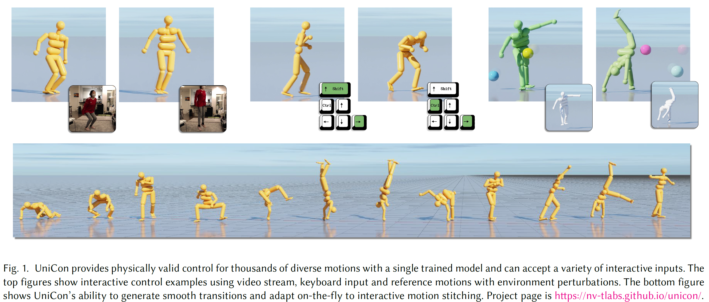
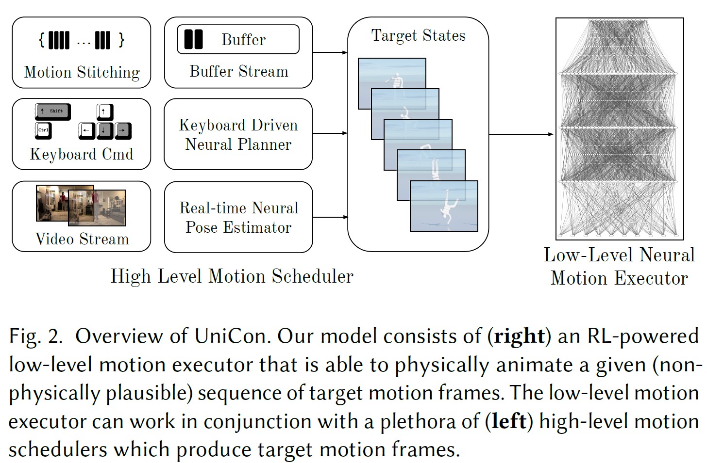

# UniCon: Universal Neural Controller For Physics-based Character Motion

Motion Scheduler + Motion Executor(RL)

Objective function & training techniques...

Train once.

Keyboard driven controller

physics-based virtual avatar

SOTA over the DeepMimic

## 1. Intro

Training Efficiency, Robustness, Motion Capacity, and generalizability.

- a low-level motion executor  <- Key innovation
- a high-level motion schedular (get inputs from keyboard or sth)

Utilize a constrained multi-objective reward optimization,  a motion balancer and a policy variance controller.

Executor done, Utilize motions schedulers for applications.

Keyboard-driven control, compose user-specified motion sequences, and supports teleporting a person video to avatar.

Key improvements over previous work

- ### Generalization

  Imitate unseen motions 

  Natural transition  between motions without recording samples.

- ### Robustness

  Zero-shot

  Characters with widely varying mass, slower or faster motion than trained motions

  

- ### Interactive Applications

  Ranging from keyboard commands, pose from video, suer-specified motions without retrain or fine-tune

- ### Learning Efficiency

  Our algorithm is better

## 2. Related works

#### 	2.1. Keyframe Based Animation

#### 	2.2. Non-interactive Physics-based Methods

#### 	2.3. Interactive Physics-based Methods

## 3. Overview

## 4.  Low Level Motion Executor

#### 	4.1. Observation Function

Input Observation Function $s_t$ encodes information about both the current state $\tilde\chi_t$ and the target future state $[\chi_{t+1}, ..., \chi_{t+\tau}]$.

Generate the corresponding control signal as output

Use an agent-centric state encoding operator $T_{p^r},_{q^r}$, which transforms the quaternion, translation and the corresponding velocity with respect to the root $p^r ,q^r$.

#### 	4.2. Controller

Torque based controller

Fully connected network 

3 hidden layers of 1024 units

#### 	4.3. Constrained Multiobjective Reward Optimization

Reward function is same as DeepMimic

## 5. Training

#### 	5.1. Motion Balancer

#### 	5.2. Reactive State Initialization Scheme

#### 	5.3. Policy Variance Controller

## 6. High Level Motion Scheduler

#### 	6.1. Motion Dataset Training Scheduler

#### 	6.2. Video Stream Scheduler

#### 	6.3. Keyboard Driven Interactive Control Scheduler

#### 	6.4. Motion Stitching Scheduler

## 7. Environment

#### 	7.1. Physics Engine

#### 	7.2. Humanoid Model

## 8. Experiments

#### 	8.1. Low-level Controller Baselines

#### 	8.2. Training Performance

#### 	8.3. Transfer Learning with Fine-tuning

#### 	8.4. Ablation Study on Low-Level Executor

#### 	8.5. Zero-Shot Robustness

## 9. Interactive Applications

#### 	9.1. Keyboard Driven Interactive Control

#### 	9.2. Interactive Motion Stitching

#### 	9.3. Interactive Video Controlled Animation

## 10. Conclusion And Discussion

#### What we did

- optimization
- motion balancing
- variance control

#### limitation

- quality
- physical interaction