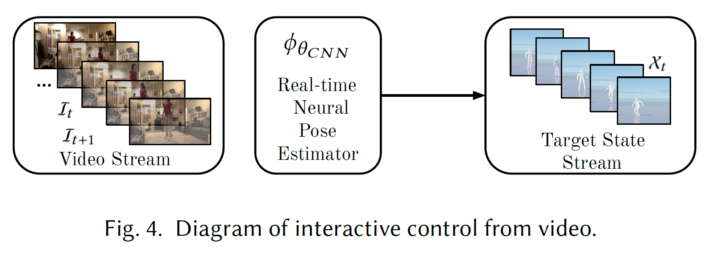

# UniCon: Universal Neural Controller For Physics-based Character Motion

Motion Scheduler + Motion Executor(RL)

Objective function & training techniques...

Train once.

Keyboard driven controller

physics-based virtual avatar

SOTA over the DeepMimic

## 1. Intro

Training Efficiency, Robustness, Motion Capacity, and generalizability.

- a low-level motion executor  <- Key innovation
- a high-level motion schedular (get inputs from keyboard or sth)

Utilize a constrained multi-objective reward optimization,  a motion balancer and a policy variance controller.

Executor done, Utilize motions schedulers for applications.

Keyboard-driven control, compose user-specified motion sequences, and supports teleporting a person video to avatar.

Key improvements over previous work

- ### Generalization

  Imitate unseen motions 

  Natural transition  between motions without recording samples.

- ### Robustness

  Zero-shot

  Characters with widely varying mass, slower or faster motion than trained motions

  

- ### Interactive Applications

  Ranging from keyboard commands, pose from video, suer-specified motions without retrain or fine-tune

- ### Learning Efficiency

  Our algorithm is better

## 2. Related works

#### 	2.1. Keyframe Based Animation

#### 	2.2. Non-interactive Physics-based Methods

#### 	2.3. Interactive Physics-based Methods

## 3. Overview

## 4.  Low Level Motion Executor

#### 	4.1. Observation Function

Input Observation Function $s_t$ encodes information about both the current state $\tilde\chi_t$ and the target future state $[\chi_{t+1}, ..., \chi_{t+\tau}]$.

Generate the corresponding control signal as output

Use an agent-centric state encoding operator $T_{p^r},_{q^r}$, which transforms the quaternion, translation and the corresponding velocity with respect to the root $p^r ,q^r$.

#### 	4.2. Controller

Torque based controller

Fully connected network 

3 hidden layers of 1024 units

#### 	4.3. Constrained Multiobjective Reward Optimization

Reward function is the same as DeepMimic

Penalize all joints and root rotation end effector.

Separated reward term.

Early termination if one of the rewards is below 0.1

## 5. Training

Use PPO

4096 workers

64 samples per iteration per worker

#### 	5.1. Motion Balancer

Dataset is imbalanced.

Motion label class

**root-walking-forward-specialStyle-zombie**

Uniformly sampling the motions.

#### 	5.2. Reactive State Initialization Scheme

over RSI in DeepMimic, we propose RSIS.

the agent is initialized with a state of the frame k time-steps away from the actual target frame.

includes a much larger noise added to the velocity and translation of the initialized state

recovering skills can be learnt automatically without the need to train or adding

5-10 time-steps which does not lead to early termination.

#### 	5.3. Policy Variance Controller

Avoiding bad local minima.

In PPO, a trainable vector $\hat\sigma\in\mathbb{R}^{|a_t|}$ is used to represent the diagonal Gaussian policy standard deviation.

Different joints require variance of different scales for a character.

propose an adaptive variance update scheme as follows:
$$
\hat\sigma'\leftarrow\hat\sigma-\alpha_{lr}\nabla_{\hat\sigma}L_{PPO},\\
\hat\sigma'\leftarrow
\begin{cases}\begin{aligned}
 \mathcal{Z}(\hat\sigma')&,&&l<\mathcal{L}\\
 \hat\sigma'&,&&Else 
\end{aligned}\end{cases}
$$
where $L_{PPO}$ is the loss, $\alpha_{lr}$ is the learning rate, and $l$ is the current PPO training iteration.

Control iteration range from 0 to $\mathcal{L}$.

$\mathcal{Z}$ is the operation where we linearly increase or decrease the log of each component of $\hat\sigma$ by the same amount.

We preserve the learnt variance structure.

## 6. High Level Motion Scheduler

$$
[\chi_{t+1},\ ...,\chi_{t+\tau}]=\phi_\theta
\Big(
\{c_i\}^t_{i=t-\tau_c},\{\tilde\chi_i\}^t_{i=t-\tau_x},t
\Big)
$$

$\tau$ future frames - 1 or 2

$c_i, \tilde\chi_i$ control signals and actual robot state

$\tau_c, \tau_x$ history length to consider

$\theta$ the parameters or configurations of the scheduler

#### 	6.1. Motion Dataset Training Scheduler

Data Preparation - CMU Mocap dataset - extremely unbalanced

grouping via style and tasks

Split test set in categories.

Use motion balancer in 5.1

#### 	6.2. Video Stream Scheduler

We Use [3D Pose Estimation](https://openaccess.thecvf.com/content_CVPR_2020/html/Iqbal_Weakly-Supervised_3D_Human_Pose_Learning_via_Multi-View_Images_in_the_CVPR_2020_paper.html) $\mathcal{F}_{\theta_{CNN}}$

Video Frame at $t+1$ as $\mathcal{I}_{t+1}$.

Prediction:
$$
\mathcal{P}_{t+1}=\Big[p^r_{t+1},q^r_{t+1},p^r_{j+1},q^r_{j+1} \Big]= \mathcal{F}_{\theta_{CNN}}(\mathcal{I}_{t+1})
$$
UDP(User Datagram Protocol) system connects the animation engine and the pose-estimator, sending $\mathcal{P}_{t+1}$ in a real-time fashion.

Video stream scheduler:
$$
\chi_{t+1}=\Big[\phi_{\theta_{CNN}}(\mathcal{I}_{t+1}),Interp\Big(\{\mathcal{P}^t_{i=t-\tau_i}\}\Big)\Big]
$$

#### 	6.3. Keyboard Driven Interactive Control Scheduler

[PFNN(Phase-functioned neural networks)](http://theorangeduck.com/page/phase-functioned-neural-networks-character-control) 

$$
\chi_{t+1}=\phi_{\theta_{PFNN}}\Big(\chi_t,\{c_i\}^t_{t=t-\tau_c}\Big)
$$
Feed back the state from low-level executor

#### 	6.4. Motion Stitching Scheduler

User can specify the motion for the character

## 7. Environment

#### 	7.1. Physics Engine

The Simulator is similar to Gym.

GPU-accelerated Flex physics engine.

#### 	7.2. Humanoid Model

20 rigid-bodies and 35 DOF

the learned policy generalizes across different models.

## 8. Experiments

Our low-level executor performs better in almost every metric and exhibits zero-shot robustness to environment perturbations not seen during training.

#### 	8.1. Low-level Controller Baselines

Compared baselines

- PD-based Method

  Similar to [DReCon](https://montreal.ubisoft.com/en/drecon-data-driven-responsive-control-of-physics-based-characters/), except for the fact that DReCon uses an online motion matching system to generate target states, whereas we directly use the target states from the dataset. We also use similar hyper-parameters from DReCon. We show another simple variant of removing the actual state from the observation function and performing open-loop control, which we name as Kinematic-State baseline.

- [[Chentanez et al. 2018]](https://dl.acm.org/doi/10.1145/3274247.3274506)

  This is similar to PD-based methods, but the observation function of the policy network contains additional long-term information. A concatenation of future frames with 0, 4, 16, 64 time-step offsets are fed as observations into the tracking network, which outputs PD targets to control the humanoid. We do not include a separate recovery agent as in the original paper, since it can be applied to any algorithm being compared here.

- DeepMicmic-Onehot and DeepMimic-Variable

  The original DeepMimic algorithm supports multi-motion training through the use of a one-hot vector to encode motion information into the observation function, which we name as DeepMimic-Onehot. Since the number of motions during training can be quite large, we also include another variant called DeepMimic-Variable, where we feed the ID of the motion to the observation function.

#### 	8.2. Training Performance

#### 	8.3. Transfer Learning with Fine-tuning

#### 	8.4. Ablation Study on Low-Level Executor

#### 	8.5. Zero-Shot Robustness

- Zero-shot Perturbation Robustness

- Zero-shot Speed Robustness
- Zero-shot Model Retargeting Robustness

## 9. Interactive Applications

#### 	9.1. Keyboard Driven Interactive Control

#### 	9.2. Interactive Motion Stitching

#### 	9.3. Interactive Video Controlled Animation

## 10. Conclusion And Discussion

#### What we did

- optimization
- motion balancing
- variance control

#### limitation

- quality
- physical interaction